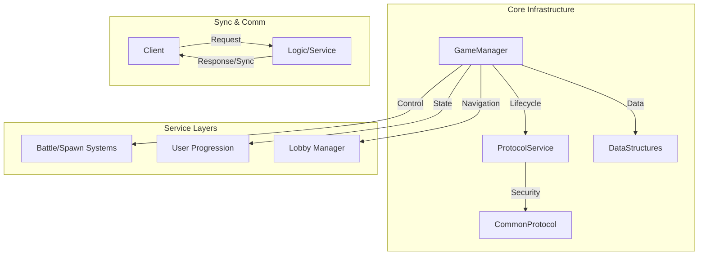

# PROJECT_DOCS: 01. 아키텍처 및 기반 시스템 (Architecture & Infra)

본 문서는 `MapleWorlds-Defense` 프로젝트의 최상위 아키텍처 구조와 시스템 운영을 위한 기반 서비스 및 인프라 로직을 설명합니다.

---

## 1. 전역 아키텍처 개요 (Global Architecture)

프로젝트는 **Data-Driven Singleton Service** 패턴을 기반으로 설계되었습니다. 핵심 로직은 전역 `Logic` 객체들이 담당하며, 각 도메인별 `Service`가 상호 참조를 통해 시스템을 운영합니다.

---

## 2. 핵심 관리 시스템 (Global Managers)

### 2.1 GameManager
게임의 생명주기와 전체적인 흐름을 제어하는 중추적인 `Logic`입니다.
- **주요 역할**:
    - 게임 상태(`isPlaying`) 및 타이머 제어.
    - 스테이지 진입(`LocalGameStart`) 및 결과 정산(`StageClearServer`) 조정.
    - 하드모드, 이벤트 모드 플래그 관리 및 배경 처리.
- **핵심 메서드**:
    - `GameStart()`: 서버 사이드 게임 초기화 및 자원 세팅.
    - `StageClearServer()`: 클리어 판정, 랭킹 업데이트, 보상 지급 로직 트리거.

### 2.2 ProtocolService & CommonProtocol
서버와 클라이언트 간의 안전한 통신을 보장하기 위한 보안 및 공통 로직 클래스입니다.
- **주요 역할**:
    - `CommonCall(uid)`: 모든 프로토콜 요청 시 유저 ID 유효성 검사.
    - `LogAndKick(uid, msg)`: 비정상 요청 감지 시 로그를 기록하고 유저를 월드에서 강제 퇴장(Kick) 처리.
- **특이사항**: 
    - `ProtocolService`는 전역 `Logic`으로 접근 가능하며, `CommonProtocol`은 컴포넌트 형태로 필요한 곳에 부착되어 사용됩니다.

---

## 3. 커스텀 데이터 구조 (Custom Data Structures)

mLua 환경에서 효율적인 데이터 처리를 위해 표준 테이블 이상의 기능을 제공하는 커스텀 `Struct`들이 구현되어 있습니다.

| 구조체 명 | 설명 | 주요 메서드 |
| :--- | :--- | :--- |
| **LIST** | 동적 배열을 관리하는 구조체 | `Add`, `Remove`, `Insert`, `ToTable` |
| **MAP** | 키-값 쌍의 해시 맵 관리 | `Put`, `Get`, `Remove`, `Keys` |
| **QUEUE** | 선입선출(FIFO) 자료구조 | `Enqueue`, `Dequeue`, `Peek` |
| **STACK** | 후입선출(LIFO) 자료구조 | `Push`, `Pop`, `Peek` |
| **PRIORITY_QUEUE** | 가중치 기반 우선순위 큐 | `Enqueue(item, priority)`, `Dequeue` |

- **활용 예시**: 시너지 계산 목록(`SynergyList`), 스폰 몬스터 대기열, 랭킹 데이터 정렬 등에 적극적으로 활용됩니다.

---

## 4. 실행 공간 제어 (Execution Space)

본 프로젝트는 MSW의 성능 최적화를 위해 실행 공간을 엄격히 구분합니다.
- **ServerOnly / Server**: 보상 지급, 데이터 저장, 몬스터 스폰 확정 등 데이터 무결성이 중요한 로직.
- **ClientOnly / Client**: UI 업데이트, 애니메이션 연출, 입력 감지 등의 연산.
- **Multicast**: 모든 유저에게 동시에 보여야 하는 연출(예: 데미지 스킨 노출 등) 등에 활용됩니다.
