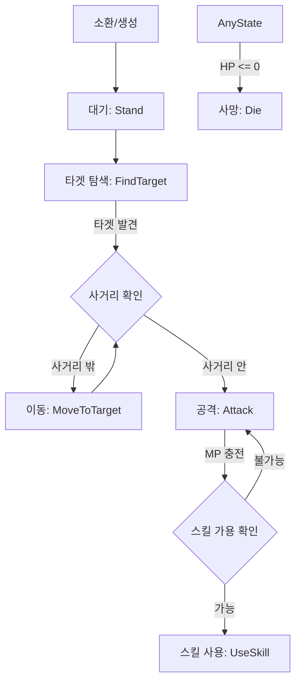

# PROJECT_DOCS: 02. 핵심 전투 시스템 (Core Battle System)

본 문서는 `MapleWorlds-Defense`의 핵심 게임플레이인 유닛의 전투 메커니즘, 몬스터 스폰 시스템 및 스킬 시스템을 설명합니다.

---

## 1. 유닛 전투 메커니즘 (Unit Combat)

모든 아군 유닛과 적군은 `Unit.mlua` 컴포넌트를 통해 공통적인 전투 로직을 공유합니다.

### 1.1 전투 흐름 (Battle Cycle)
유닛은 생성 직후부터 사망 전까지 다음의 상태 머신(State Machine)에 따라 행동합니다.

### 1.2 공격 타입 (Melee vs Range)
- **근접(Melee)**: `PlayTween`을 통해 타겟에게 돌진하며 직접 데미지를 입힙니다.
- **원거리(Range)**: `Projectile` 엔티티를 생성하여 투사체를 발사하고, 투사체가 타겟에 닿았을 때 데미지를 처리합니다.

---

## 2. 몬스터 소환 시스템 (Monster Spawning)

`MonsterSpawnService`가 스테이지별 정적 데이터를 읽어 적군을 생성합니다.

### 2.1 스폰 패턴 클래스
- **LOOP**: 지정된 주기(`interval`)마다 지속적으로 몬스터 그룹을 소환합니다.
- **EVENT**: 특정 조건(예: 보스 타워 HP 하락 등)이 충족될 때 일회성으로 소환합니다.

### 2.2 그룹 소환 로직
하나의 스폰 그룹은 여러 마리의 유닛과 각 유닛 사이의 **지연 시간(Delay)**으로 구성됩니다.
- **프로세스**: 
  1. `patternRepo`에서 스테이지 ID에 맞는 패턴 로드.
  2. `groupRepo`에서 유닛 목록 로드.
  3. `TimerService`를 이용해 지연 시간을 준수하며 월드에 `Spawn` 실행.

---

## 3. 스킬 및 버프 시스템 (Skills & Buffs)

### 3.1 액티브 스킬 (Active Skill)
유닛은 타격 시마다 MP를 획득하며, MP가 최대치에 도달하면 `curState = "useSkill"`로 전환되어 고유 스킬을 발동합니다.
- **스킬 종류**: 범위 데미지(AoE), 힐링, 일시적 무적, 디버프 부여 등.

### 3.2 버프/디버프 관리 (`UnitDebuffComponent`)
유닛에 가해지는 모든 상태 변화는 `eBuffType` 및 `eStatusDebuffType`에 따라 관리됩니다.
- **주요 상태**:
    - **Stun / Freeze**: 동작 중지.
    - **Silence**: 스킬 사용 불가.
    - **Burn**: 도트 데미지(DoT) 피해.
    - **Slow**: 이동 속도 감소.

---

## 4. 유닛 소환 및 덱 시스템 (Unit Shop & Deck)

플레이어는 인게임 자원(메소)을 사용하여 덱에 설정된 유닛을 실시간으로 소환합니다.
- **SpawnManager**: 소환 위치 검증, 비용 차감, 시너지 컴포넌트 부착을 담당합니다.
- **UnitShopUI**: 유저의 현재 메소 보유량에 따라 소환 가능한 버튼을 활성화 또는 비활성화 처리합니다.
