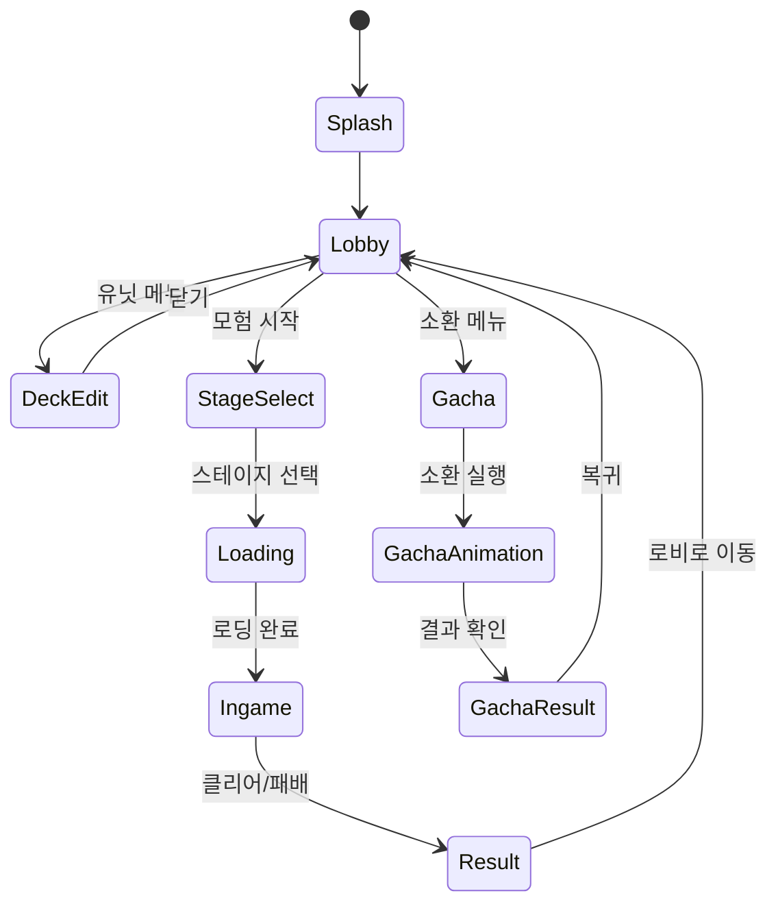

# PROJECT_DOCS: 04. UI 계층 구조 (UI Hierarchy)

본 문서는 `MapleWorlds-Defense`의 사용자 인터페이스(UI) 구성 요소와 화면 간의 전환 흐름을 설명합니다.

---

## 1. UI 관리 정책 (UI Management)

프로젝트의 UI는 기능별로 그룹화된 엔티티 구조를 가지며, `ClientOnly` 환경에서 상태 변화와 애니메이션을 처리합니다.

- **분리형 아키텍처**: 각 UI 패널은 독립적인 메인 스크립트와 버튼 제어 스크립트로 분리되어 있어 유지보수가 용이합니다.
- **상태 기반 갱신**: 서버에서 동기화된 프로퍼티가 변경될 때 `OnSyncProperty` 콜백을 통해 UI의 텍스트나 아이콘을 갱신합니다.

---

## 2. 로비 UI 트리 (Lobby UI Tree)

로비는 게임의 메인 허브로, 다양한 관리 및 진입점 기능을 포함합니다.

### 2.1 계층 구조
- **LobbyMainUI**
    - `TopBar`: 재화 정보(메소, 젬), 유저 프로필, 설정 버튼.
    - `SideMenu`: 공지사항, 출석부, 랭킹 진입점.
    - `BottomNavigation`:
        - **Adventure**: 스테이지 선택 팝업 트리거.
        - **Party**: 유닛 덱 편집 및 캐릭터 상세 보기.
        - **Gacha**: 소환 탭 이동.
        - **Shop**: 상점 진입.

### 2.2 주요 팝업 로직
- **StageSelectUI**: 
    - 챕터 리스트 스크롤 뷰 구현.
    - 현재 해금된 스테이지만 활성화하며, 클리어한 곳은 별(Star) 아이콘 표시.
- **DeckEditUI**:
    - 보유 유닛 목록에서 5마리의 유닛을 선택하여 덱으로 구성.
    - 시너지 미리보기 패널을 통해 현재 조합의 버프 상태 실시간 계산 노출.

---

## 3. 인게임 UI 트리 (Ingame UI Tree)

전투 상황을 실시간으로 중계하고 유저 명령을 전달하는 HUD(Heads-up Display) 구조입니다.

### 3.1 계층 구조
- **IngameHUD**
    - `StatusPanel`: 타워 체력바, 남은 시간, 현재 웨이브 진행도.
    - `UnitShopBar`: 하단에 위치하며, 소환 가능한 5종 유닛 아이콘과 비용 표시.
    - `SkillPanel`: 액티브 스킬 버튼 및 쿨타임 애니메이션 오버레이.
    - `SynergyPanel`: 현재 유닛 소환에 따라 활성화된 시너지 목록 실시간 갱신.

### 3.2 연출 요소
- **DamageSkin**: 타격 시 수치화된 데미지 텍스트가 팝업되어 사라짐.
- **UnitHPBar**: 모든 유닛 머리 위에 동적으로 정렬되는 체력바 배치.
- **RewardPopup**: 게임 종료 시 정산 결과를 보여주는 전용 팝업.

---

## 4. UI 상태 전이 Flow

