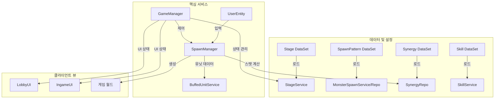
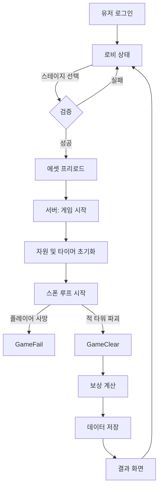
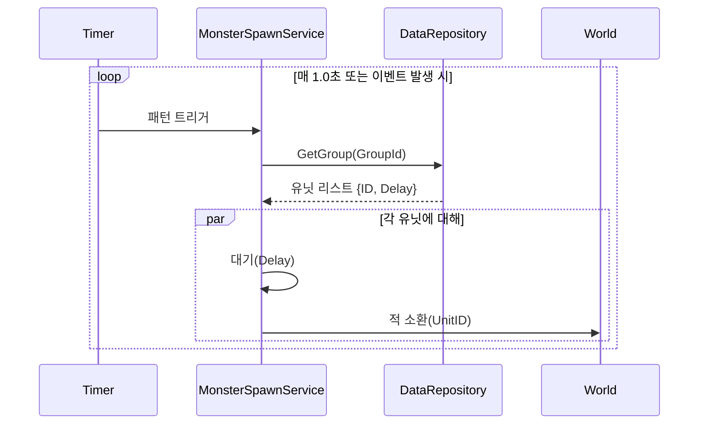
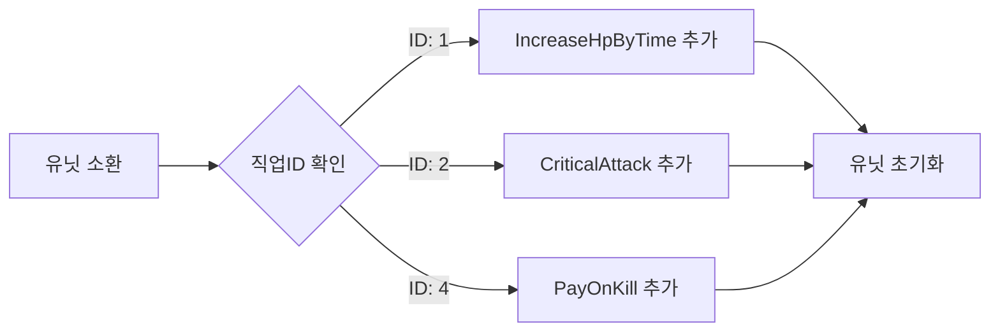

# MapleWorlds Defense: 기술 명세서

## 1. 시스템 아키텍처 (System Architecture)

### 1.1 상위 레벨 아키텍처
본 시스템은 **데이터 주도 설계(Data-Driven Design)** 패턴을 따릅니다. `Repository` 계층이 정적 데이터(Excel/DataSet)를 로드하고, `Manager/Service` 계층이 동적인 게임 로직을 처리합니다. `Entity`는 컴포넌트들의 순수한 조합으로 이루어집니다.



---

## 2. 핵심 게임 시스템 (Core Game Systems)

### 2.1 게임 루프 및 생명주기
`GameManager`가 전역 상태를 제어합니다.

#### [로직: 순서도]


### 2.2 몬스터 소환 메커니즘
`MonsterSpawnService`에 의해 제어됩니다.

#### [데이터 구조: 패턴]
| 필드명 | 설명 |
| :--- | :--- |
| **Type** | `LOOP` (주기적), `EVENT` (트리거 기반) |
| **Group** | 소환할 유닛 ID 리스트 |
| **Setting** | 간격(초) 또는 임계값(HP%) |

#### [로직: 소환 실행]


---

## 3. 전투 및 캐릭터 메커니즘 (Combat & Mechanics)

### 3.1 유닛 소환 및 비용 시스템 (`SpawnManager`)
플레이어는 자원(메소)을 사용하여 유닛을 소환합니다.

- **검증**: `UserWallet >= UnitCost`
- **프로세스**:
    1.  비용 확인.
    2.  자원 차감.
    3.  `MySpawnPoint` 위치에 유닛 생성(Instantiate).
    4.  **시너지 버프 적용** (동적 컴포넌트 추가).
    5.  `SkillData`로 `UnitComponent` 초기화.

### 3.2 시너지 시스템 (`SynergyRepo` & `SpawnManager`)
유저의 현재 유닛 조합에 따라 버프가 동적으로 적용됩니다.

#### [로직: 동적 컴포넌트 부착]
유닛 소환 시, 시스템은 특정 **직업 ID(Job ID)**를 확인하고 네이티브 컴포넌트를 동적으로 부착합니다.

| Job ID | 직업군 | 버프 효과 / 컴포넌트 |
| :--- | :--- | :--- |
| **1** | 전사 (Warrior) | `IncreaseHpByTime` (체력 재생) |
| **2** | 궁수 (Archer) | `CriticalAttack` (치명타 확률/피해) |
| **3** | 마법사 (Mage) | `IncreaseMpByTime` (마나 재생) |
| **4** | 서포터 (Support) | `AddSummonPointAfterKill` (처치 시 코스트 획득) |



---

## 4. UI/UX 계층 구조 (UI/UX Hierarchy)

### 4.1 로비 UI 트리 (`Lobby_UI`)
- **[Layer: Main]**
    - `TopPanel`: 유저 재화 (`Gem`, `Meso`), `SettingsBtn`(설정)
    - `CenterPanel`: 캐릭터 프리뷰 (3D 모델)
    - `BottomPanel`:
        - `StartBtn` -> 동작: `OpenStageSelectPopup`(스테이지 선택)
        - `DeckBtn` -> 동작: `OpenDeckEditPopup`(덱 편집)
        - `ShopBtn` -> 동작: `OpenCashShop`(상점)

- **[Layer: Popup]**
    - `StageSelectUI`: 챕터 목록 스크롤 뷰.
        - `StageItem`: 별 개수, 클리어 상태 표시.
    - `HardModeToggle`: 노말/하드 모드 전환 스위치 (`GameManager.isHardMode`에 영향).

### 4.2 인게임 UI 트리 (`Ingame_Info_UI_Group`)
- **[Layer: HUD]**
    - `TopCenter`: `TimerText` (MM:SS), `WaveProgressBar`(웨이브 진행도).
    - `BottomLeft`: `UnitShop` (소환 가능한 유닛 목록 및 비용 표시).
    - `BottomRight`: `SkillButtons` (액티브 스킬, 쿨타임 오버레이 포함).
    - `Float`: `DamageSkin` (데미지 텍스트), `HPBar` (타겟 추적 체력바).

---

## 5. 데이터 모델 및 상수 (Data Models & Constants)

### 5.1 주요 상수 테이블
`GameManager`와 `StageService`에 정의된 값들입니다.

| 카테고리 | 변수명 | 값 | 설명 |
| :--- | :--- | :--- | :--- |
| **보상** | `HardModeMultiplier` | `1.5` | 하드 모드 클리어 시 골드/경험치 배율 |
| **유닛** | `PlayerTower.MaxHP` | `500` | 기본 타워 체력 |
| **스테이지** | `EnemyTower.MaxHP` | *Dynamic* | `stage` 테이블에서 로드됨 |
| **시너지** | `InitMesoID` | `5` | 초기 소지금 보너스 시너지 ID |

### 5.2 스테이지 데이터 스키마
출처: `StageService.mlua` (Data/stage)

```lua
{
    id = "String",              -- 고유 키 (예: "101")
    chapter = "Integer",        -- 챕터 번호
    stage = "Integer",          -- 스테이지 번호
    enemy_tower_hp = "Number",  -- 목표 파괴 체력
    hard_level = "Number",      -- 하드 모드 레벨 보정치
    synergy_id = "String"       -- 스테이지 전용 시너지 밴/버프 ID
}
```
